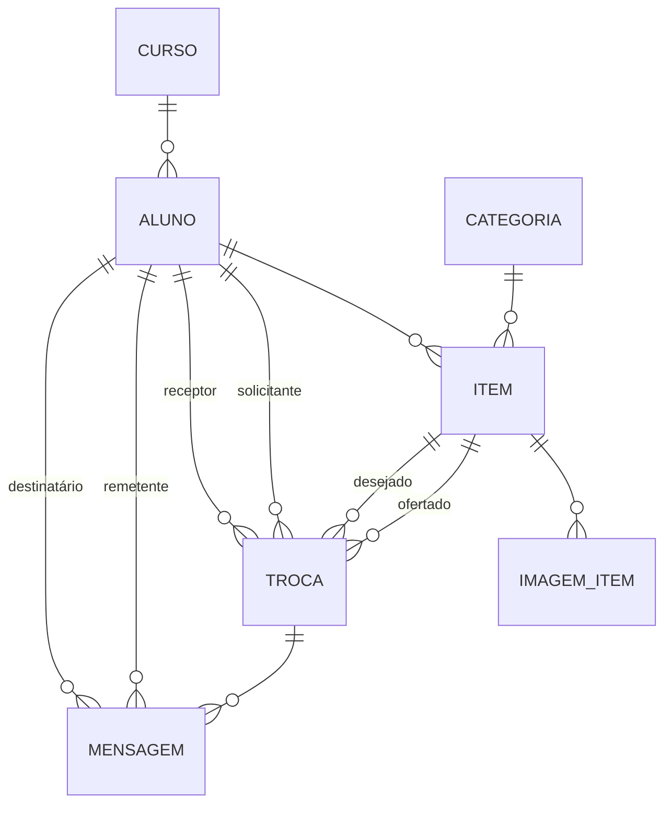

# 📊 DOCUMENTAÇÃO DO BANCO DE DADOS

**SENAI EXCHANGE** | PostgreSQL 15 | v1.0

---

## 📐 DER - Diagrama Entidade-Relacionamento



---

## 📋 TABELAS

| Tabela | Descrição |
|---|---|
| **tb_curso** | Cursos (Desenvolvimento, Eletrônica, Mecânica, Administração) |
| **tb_aluno** | Usuários do sistema |
| **tb_categoria** | Categorias de itens (Ferramentas, Livros, Eletrônicos, Outros) |
| **tb_item** | Itens publicados por alunos |
| **tb_imagem_item** | Imagens dos itens (até 3 por item) |
| **tb_troca** | Trocas entre alunos (status: PENDENTE → ACEITA/RECUSADA → FINALIZADA) |
| **tb_mensagem** | Mensagens durante negociação |

---

## 🗄️ SCRIPTS SQL

### Criar Sequências

```sql
-- Sequências para auto-increment
CREATE SEQUENCE tb_curso_id_curso_seq START 1;
CREATE SEQUENCE tb_aluno_id_aluno_seq START 1;
CREATE SEQUENCE tb_categoria_id_categoria_seq START 1;
CREATE SEQUENCE tb_item_id_item_seq START 1;
CREATE SEQUENCE tb_imagem_item_id_imagem_seq START 1;
CREATE SEQUENCE tb_troca_id_troca_seq START 1;
CREATE SEQUENCE tb_mensagem_id_mensagem_seq START 1;
```

### Criar Tabelas

```sql
-- TB_CURSO
CREATE TABLE tb_curso (
    id_curso SERIAL PRIMARY KEY,
    nome_curso VARCHAR(50) NOT NULL UNIQUE
);

-- TB_ALUNO
CREATE TABLE tb_aluno (
    id_aluno SERIAL PRIMARY KEY,
    nome_aluno VARCHAR(200) NOT NULL,
    email VARCHAR(200) NOT NULL UNIQUE,
    senha VARCHAR(200) NOT NULL,
    tb_curso_id_curso INTEGER NOT NULL REFERENCES tb_curso(id_curso)
);

-- TB_CATEGORIA
CREATE TABLE tb_categoria (
    id_categoria SERIAL PRIMARY KEY,
    nome_categoria VARCHAR(100) NOT NULL UNIQUE
);

-- TB_ITEM
CREATE TABLE tb_item (
    id_item SERIAL PRIMARY KEY,
    nome_item VARCHAR(200) NOT NULL,
    descricao VARCHAR(500),
    tb_aluno_id_aluno INTEGER NOT NULL REFERENCES tb_aluno(id_aluno),
    tb_categoria_id_categoria INTEGER NOT NULL REFERENCES tb_categoria(id_categoria)
);

-- TB_IMAGEM_ITEM
CREATE TABLE tb_imagem_item (
    id_imagem SERIAL PRIMARY KEY,
    url_imagem BYTEA,
    tb_item_id_item INTEGER NOT NULL REFERENCES tb_item(id_item) ON DELETE CASCADE
);

-- TB_TROCA
CREATE TABLE tb_troca (
    id_troca SERIAL PRIMARY KEY,
    status VARCHAR(10) NOT NULL DEFAULT 'PENDENTE',
    data_criacao TIMESTAMP NOT NULL DEFAULT CURRENT_TIMESTAMP,
    tb_aluno_id_solicitante INTEGER NOT NULL REFERENCES tb_aluno(id_aluno),
    tb_aluno_id_receptor INTEGER NOT NULL REFERENCES tb_aluno(id_aluno),
    tb_item_id_item_ofertado INTEGER REFERENCES tb_item(id_item),
    tb_item_id_item_desejado INTEGER NOT NULL REFERENCES tb_item(id_item),
    CONSTRAINT tb_troca_status_check CHECK (status IN ('PENDENTE', 'ACEITA', 'RECUSADA', 'FINALIZADA'))
);

-- TB_MENSAGEM
CREATE TABLE tb_mensagem (
    id_mensagem SERIAL PRIMARY KEY,
    mensagem TEXT NOT NULL,
    data_envio TIMESTAMP NOT NULL DEFAULT CURRENT_TIMESTAMP,
    tb_aluno_id_remetente INTEGER NOT NULL REFERENCES tb_aluno(id_aluno),
    tb_aluno_id_destinatario INTEGER NOT NULL REFERENCES tb_aluno(id_aluno),
    tb_troca_id_troca INTEGER NOT NULL REFERENCES tb_troca(id_troca) ON DELETE CASCADE
);
```

### Criar Índices

```sql
CREATE INDEX idx_aluno_email ON tb_aluno(email);
CREATE INDEX idx_item_aluno ON tb_item(tb_aluno_id_aluno);
CREATE INDEX idx_item_categoria ON tb_item(tb_categoria_id_categoria);
CREATE INDEX idx_troca_solicitante ON tb_troca(tb_aluno_id_solicitante);
CREATE INDEX idx_troca_receptor ON tb_troca(tb_aluno_id_receptor);
CREATE INDEX idx_troca_status ON tb_troca(status);
CREATE INDEX idx_mensagem_troca ON tb_mensagem(tb_troca_id_troca);
```

### Dados Iniciais

```sql
INSERT INTO tb_curso (nome_curso) VALUES 
('Desenvolvimento de Sistemas'), ('Eletrônica'), 
('Mecânica'), ('Administração');

INSERT INTO tb_categoria (nome_categoria) VALUES 
('Ferramentas'), ('Livros'), ('Eletrônicos'), ('Outros');
```

---

## 📚 DICIONÁRIO DE DADOS

### TB_ALUNO

| Campo | Tipo | Null | PK | FK | Descrição |
|---|---|---|---|---|---|
| id_aluno | SERIAL | ✗ | ✓ | ✗ | ID único |
| nome_aluno | VARCHAR(200) | ✗ | ✗ | ✗ | Nome do aluno |
| email | VARCHAR(200) | ✗ | ✗ | ✗ | Email (único) |
| senha | VARCHAR(200) | ✗ | ✗ | ✗ | Senha BCrypt |
| tb_curso_id_curso | INTEGER | ✗ | ✗ | ✓ | Curso |

### TB_ITEM

| Campo | Tipo | Null | PK | FK | Descrição |
|---|---|---|---|---|---|
| id_item | SERIAL | ✗ | ✓ | ✗ | ID único |
| nome_item | VARCHAR(200) | ✗ | ✗ | ✗ | Nome |
| descricao | VARCHAR(500) | ✓ | ✗ | ✗ | Descrição |
| tb_aluno_id_aluno | INTEGER | ✗ | ✗ | ✓ | Dono |
| tb_categoria_id_categoria | INTEGER | ✗ | ✗ | ✓ | Categoria |

### TB_TROCA

| Campo | Tipo | Null | PK | FK | Descrição |
|---|---|---|---|---|---|
| id_troca | SERIAL | ✗ | ✓ | ✗ | ID único |
| status | VARCHAR(10) | ✗ | ✗ | ✗ | PENDENTE/ACEITA/RECUSADA/FINALIZADA |
| data_criacao | TIMESTAMP | ✗ | ✗ | ✗ | Data de criação |
| tb_aluno_id_solicitante | INTEGER | ✗ | ✗ | ✓ | Quem propõe |
| tb_aluno_id_receptor | INTEGER | ✗ | ✗ | ✓ | Dono do item |
| tb_item_id_item_ofertado | INTEGER | ✓ | ✗ | ✓ | Item oferecido |
| tb_item_id_item_desejado | INTEGER | ✗ | ✗ | ✓ | Item desejado |

### TB_MENSAGEM

| Campo | Tipo | Null | PK | FK | Descrição |
|---|---|---|---|---|---|
| id_mensagem | SERIAL | ✗ | ✓ | ✗ | ID único |
| mensagem | TEXT | ✗ | ✗ | ✗ | Conteúdo |
| data_envio | TIMESTAMP | ✗ | ✗ | ✗ | Data/hora |
| tb_aluno_id_remetente | INTEGER | ✗ | ✗ | ✓ | Quem envia |
| tb_aluno_id_destinatario | INTEGER | ✗ | ✗ | ✓ | Quem recebe |
| tb_troca_id_troca | INTEGER | ✗ | ✗ | ✓ | Troca |

### TB_CURSO

| Campo | Tipo | Null | PK | FK | Descrição |
|---|---|---|---|---|---|
| id_curso | SERIAL | ✗ | ✓ | ✗ | ID único |
| nome_curso | VARCHAR(50) | ✗ | ✗ | ✗ | Nome (único) |

### TB_CATEGORIA

| Campo | Tipo | Null | PK | FK | Descrição |
|---|---|---|---|---|---|
| id_categoria | SERIAL | ✗ | ✓ | ✗ | ID único |
| nome_categoria | VARCHAR(100) | ✗ | ✗ | ✗ | Nome (único) |

### TB_IMAGEM_ITEM

| Campo | Tipo | Null | PK | FK | Descrição |
|---|---|---|---|---|---|
| id_imagem | SERIAL | ✗ | ✓ | ✗ | ID único |
| url_imagem | BYTEA | ✓ | ✗ | ✗ | Dados da imagem |
| tb_item_id_item | INTEGER | ✗ | ✗ | ✓ | Item |

---

## 🔗 RELACIONAMENTOS

### Relacionamentos 1:N

| De | Para | Cardinalidade | Descrição | Cascata |
|---|---|---|---|---|
| CURSO | ALUNO | 1:N | Um curso tem muitos alunos | ✗ |
| ALUNO | ITEM | 1:N | Um aluno publica muitos itens | ✓ |
| ALUNO | TROCA (solicitante) | 1:N | Um aluno solicita muitas trocas | ✓ |
| ALUNO | TROCA (receptor) | 1:N | Um aluno recebe muitas propostas | ✓ |
| ALUNO | MENSAGEM (remetente) | 1:N | Um aluno envia muitas mensagens | ✓ |
| ALUNO | MENSAGEM (destinatário) | 1:N | Um aluno recebe muitas mensagens | ✓ |
| CATEGORIA | ITEM | 1:N | Uma categoria tem muitos itens | ✓ |
| ITEM | IMAGEM_ITEM | 1:N | Um item tem muitas imagens | ✓ |
| ITEM | TROCA (ofertado) | 1:N | Um item pode ser ofertado em muitas trocas | ✗ |
| ITEM | TROCA (desejado) | 1:N | Um item pode ser desejado em muitas trocas | ✗ |
| TROCA | MENSAGEM | 1:N | Uma troca tem muitas mensagens | ✓ |

---

## ⚙️ CONSTRAINTS & VALIDAÇÕES

### Check Constraints

```sql
-- Validação de Status
CHECK (status IN ('PENDENTE', 'ACEITA', 'RECUSADA', 'FINALIZADA'))
```

### Unique Constraints

```sql
-- Email único por aluno
UNIQUE (email)

-- Nome único por curso
UNIQUE (nome_curso)

-- Nome único por categoria
UNIQUE (nome_categoria)
```

### Foreign Key Constraints

```sql
-- Com cascata (deletar pai deleta filhos)
FOREIGN KEY (tb_aluno_id_aluno) REFERENCES tb_aluno(id_aluno) ON DELETE CASCADE
FOREIGN KEY (tb_item_id_item) REFERENCES tb_item(id_item) ON DELETE CASCADE
FOREIGN KEY (tb_troca_id_troca) REFERENCES tb_troca(id_troca) ON DELETE CASCADE

-- Sem cascata (deletar pai não deleta filhos)
FOREIGN KEY (tb_curso_id_curso) REFERENCES tb_curso(id_curso)
FOREIGN KEY (tb_aluno_id_solicitante) REFERENCES tb_aluno(id_aluno)
FOREIGN KEY (tb_aluno_id_receptor) REFERENCES tb_aluno(id_aluno)
```

### Validações em Aplicação

```
1. Email único e válido (format)
2. Senha mínimo 6 caracteres, criptografada com BCrypt
3. Solicitante ≠ Receptor em uma troca
4. itemOfertado ≠ itemDesejado em uma troca
5. Imagens máximo 5MB cada, máximo 3 por item
6. Descrição máximo 500 caracteres
7. Nome máximo 200 caracteres
```

---

## 📈 ESTATÍSTICAS

### Estimativa de Crescimento

```
Usuários: 50-1000 alunos
Itens: ~200-2000 (2-5 itens/aluno)
Trocas: ~200-400 (4-10 trocas/aluno/ano)
Mensagens: ~1000-4000 (5-10 mensagens/troca)
Imagens: ~600-6000 (3 imagens/item)
Espaço: ~100MB-1GB (considerando imagens)
```

### Backups Recomendados

```bash
# Semanal (completo)
docker exec postgres_pbl_sistema-trocas-alunos pg_dump -U admin \
  db_sistema-trocas-alunos > backup-$(date +%Y%m%d).sql

# Diário (incremental)
# Configurar WAL archiving para backup contínuo
```

---
