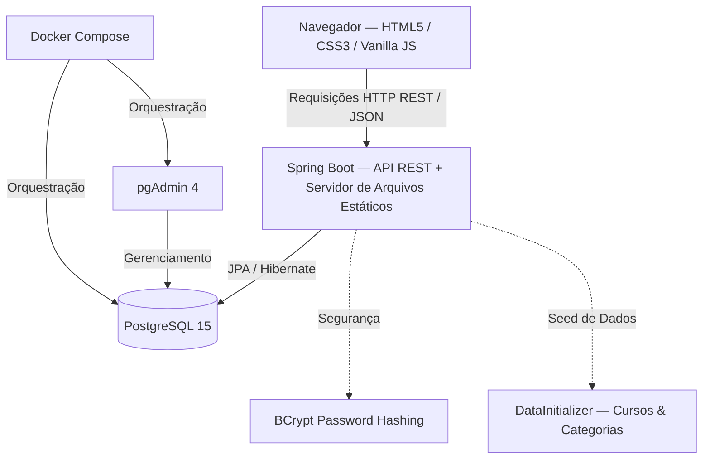

# 🔄 SENAI Exchange — Sistema de Troca de Itens entre Alunos

<p align="center">
  
</p>

<p align="center">
  <a href="#-sobre-o-projeto">Sobre</a> •
  <a href="#-funcionalidades">Funcionalidades</a> •
  <a href="#-arquitetura-do-sistema">Arquitetura</a> •
  <a href="#-estrutura-do-projeto">Estrutura</a> •
  <a href="#-tecnologias">Tecnologias</a> •
  <a href="#-como-executar">Como Executar</a> •
  <a href="#-api-endpoints">API Endpoints</a>
</p>

---

## 📝 Sobre o Projeto

O **SENAI Exchange** é uma plataforma de economia colaborativa desenvolvida especificamente para a comunidade de alunos do **SENAI**. O sistema visa facilitar o compartilhamento, doação e troca de materiais acadêmicos, ferramentas, componentes eletrônicos, livros e outros recursos didáticos de forma segura e sustentável entre os estudantes de diferentes cursos.

Com uma interface moderna e intuitiva, os alunos podem anunciar itens que não utilizam mais e solicitar a troca por recursos úteis para sua formação profissional.

---

## ✨ Funcionalidades

- 🔑 **Autenticação Segura:** Cadastro e login de alunos utilizando e-mail institucional do SENAI, com senhas criptografadas utilizando `BCrypt`.
- 📦 **Gestão de Anúncios (Catálogo):** Criação, edição, visualização e exclusão de anúncios de itens com detalhes como nome, descrição, categoria e imagens.
- 🔍 **Exploração e Filtros:** Busca inteligente por nome e filtros dinâmicos por categorias.
- 🤝 **Solicitação de Trocas:** Fluxo de negociação onde o aluno solicitante pode propor a troca de um item por outro.
- 💬 **Chat em Tempo Real:** Canal de comunicação integrado para cada proposta de troca, permitindo alinhar os detalhes e o ponto de encontro de forma segura.
- 👤 **Perfil do Usuário:** Página de edição de perfil mostrando informações do aluno, curso atual, foto de perfil e seus itens ativos.
- 🗃️ **Dados Iniciais Automáticos:** O sistema popula automaticamente cursos e categorias ao iniciar (`DataInitializer`), tornando o ambiente pronto para uso imediatamente.

---

## 🏗️ Arquitetura do Sistema

O projeto é construído como uma aplicação **monolítica com Spring Boot**, onde o backend fornece a API REST **e também serve o frontend** (HTML5 / CSS3 / Vanilla JS) como recursos estáticos. Não há servidor de frontend separado.



---

## 📂 Estrutura do Projeto

```text
sistema-trocas-alunos/
├── projeto/                                      # Projeto Spring Boot (Maven)
│   ├── src/main/java/br/com/senai/sistema_trocas/
│   │   ├── config/
│   │   │   ├── CorsConfig.java                  # Configuração de CORS
│   │   │   ├── SecurityConfig.java              # Configuração de Segurança
│   │   │   └── DataInitializer.java             # Seed automático de cursos e categorias
│   │   ├── controllers/                          # Controladores REST da API
│   │   │   ├── AlunoController.java
│   │   │   ├── CategoriaController.java
│   │   │   ├── CursoController.java
│   │   │   ├── ImagemItemController.java
│   │   │   ├── ItemController.java
│   │   │   ├── MensagemController.java
│   │   │   └── TrocaController.java
│   │   ├── entities/                             # Entidades JPA
│   │   │   ├── Aluno.java
│   │   │   ├── Categoria.java
│   │   │   ├── Curso.java
│   │   │   ├── ImagemItem.java
│   │   │   ├── Item.java
│   │   │   ├── Mensagem.java
│   │   │   └── Troca.java
│   │   ├── repositories/                         # Interfaces Spring Data JPA
│   │   └── services/                             # Regras de negócio
│   │
│   └── src/main/resources/
│       ├── application.properties                # Configurações do banco e servidor
│       └── static/                               # Frontend servido pelo Spring Boot
│           ├── index.html                        # Página principal (Explorar)
│           ├── assets/                           # Logos e recursos visuais
│           ├── pages/                            # Páginas HTML da aplicação
│           │   ├── login.html
│           │   ├── cadastro.html
│           │   ├── catalogo.html
│           │   ├── novo-anuncio.html
│           │   ├── meus-pedidos.html
│           │   ├── chat.html
│           │   └── perfil.html
│           ├── scripts/                          # Lógica JavaScript (comunicação com a API)
│           │   ├── api.js                        # Funções centralizadas de fetch
│           │   ├── autenticacao.js
│           │   ├── catalogo.js
│           │   ├── chat.js
│           │   ├── explorar.js
│           │   ├── meus-pedidos.js
│           │   ├── novo-anuncio.js
│           │   └── perfil.js
│           └── styles/                           # Estilização modular com CSS3
│
├── consultas_sql/                                # Scripts SQL de referência
│   ├── DDL.sql                                   # Criação das tabelas
│   ├── DML.sql                                   # Dados de exemplo
│   ├── DQL.sql                                   # Consultas de referência
│   └── view_procedure_function.sql               # Views, procedures e funções
│
├── caso_uso/                                     # Diagramas de caso de uso
├── docker-compose.yml                            # Orquestrador do PostgreSQL & pgAdmin
├── package.json                                  # Scripts auxiliares Node.js
└── README.md                                     # Documentação oficial do projeto
```

---

## 🛠️ Tecnologias Utilizadas

### **Backend**
- **Java 17** (Linguagem Principal)
- **Spring Boot 4.x**
  - **Spring Web MVC** (Construção de APIs RESTful + servidor de arquivos estáticos)
  - **Spring Data JPA** (Persistência e ORM com Hibernate)
  - **Spring Security Crypto** (Criptografia com BCrypt)
  - **Spring DevTools** (Hot reload em desenvolvimento)
- **PostgreSQL Driver** (Conexão ao banco)
- **Project Lombok** (Produtividade e redução de Boilerplate)

### **Frontend**
- **HTML5 Semantic Markup**
- **CSS3 Vanilla** (Variáveis nativas, Flexbox e CSS Grid para responsividade)
- **JavaScript ES6+** (Comunicação assíncrona via `fetch`, manipulação de DOM e `sessionStorage`)

### **Infraestrutura / DevOps**
- **Docker & Docker Compose** (Containerização do PostgreSQL e pgAdmin 4)
- **PostgreSQL 15** (Banco de dados relacional)
- **Maven Wrapper** (`mvnw` / `mvnw.cmd`) — sem necessidade de Maven instalado

---

## 🚀 Como Executar o Projeto

### **Pré-requisitos**
Antes de iniciar, certifique-se de ter instalado em sua máquina:
1. [Git](https://git-scm.com)
2. [Docker](https://www.docker.com/) & [Docker Compose](https://docs.docker.com/compose/)
3. [JDK 17](https://www.oracle.com/java/technologies/javase/jdk17-archive-downloads.html) ou superior
4. Uma IDE Java (recomendado: [Eclipse](https://www.eclipse.org/) ou [IntelliJ IDEA](https://www.jetbrains.com/idea/))

---

### **Passo 1: Subir o Banco de Dados (Docker)**

Na raiz do projeto (onde está o `docker-compose.yml`), execute no terminal:

```bash
docker-compose up -d
```

> Isso iniciará um container **PostgreSQL** na porta `5432` e o **pgAdmin 4** na porta `8081`.
> - **pgAdmin:** Acesse [http://localhost:8081](http://localhost:8081) com o email `admin@gmail.com` e senha `admin12345`.

---

### **Passo 2: Iniciar o Backend (Spring Boot)**

Acesse a pasta `projeto/` e execute o Maven Wrapper:

```bash
# No Windows:
cd projeto
mvnw.cmd spring-boot:run

# No Linux/macOS:
cd projeto
./mvnw spring-boot:run
```

> Ou importe o projeto `projeto/` diretamente no **Eclipse** como *Existing Maven Project* e execute a classe `SistemaTrocasApplication.java`.

> ✅ O servidor estará disponível em: **`http://localhost:8080`**
>
> ℹ️ Ao iniciar, o `DataInitializer` populará automaticamente as tabelas `tb_curso` e `tb_categoria` caso estejam vazias.

---

### **Passo 3: Acessar a Aplicação**

Como o frontend é **servido pelo próprio Spring Boot**, basta abrir o navegador e acessar:

```
http://localhost:8080
```

> Não é necessário abrir arquivos HTML diretamente ou usar Live Server. Todo o frontend está disponível via HTTP a partir do servidor Spring Boot.

---

## 🔌 API Endpoints

A API está disponível em `http://localhost:8080`:

### **Alunos (`/alunos`)**
| Método | Endpoint | Descrição |
|---|---|---|
| `POST` | `/alunos/cadastro` | Realiza o cadastro de um novo aluno |
| `GET` | `/alunos/login` | Realiza login (parâmetros `email` e `senha` via Query) |
| `GET` | `/alunos/{id}` | Busca os dados completos de um aluno pelo ID |
| `PUT` | `/alunos/{id}` | Atualiza as informações do aluno |

### **Cursos (`/cursos`)**
| Método | Endpoint | Descrição |
|---|---|---|
| `GET` | `/cursos` | Retorna todos os cursos disponíveis |

### **Categorias (`/categorias`)**
| Método | Endpoint | Descrição |
|---|---|---|
| `GET` | `/categorias` | Retorna todas as categorias de itens |

### **Itens (`/itens`)**
| Método | Endpoint | Descrição |
|---|---|---|
| `GET` | `/itens` | Retorna todos os itens cadastrados no sistema |
| `GET` | `/itens/{id}` | Busca um item específico por seu ID |
| `GET` | `/itens/aluno?value={id}` | Retorna todos os itens anunciados por um aluno |
| `GET` | `/itens/categoria?value={id}` | Retorna todos os itens de uma categoria |
| `POST` | `/itens/cadastro` | Cadastra um novo anúncio de item |
| `DELETE` | `/itens/{id}` | Exclui um anúncio específico |

### **Imagens de Itens (`/imagens`)**
| Método | Endpoint | Descrição |
|---|---|---|
| `POST` | `/imagens/cadastro` | Vincula uma imagem a um item |
| `DELETE` | `/imagens/{id}` | Remove uma imagem |

### **Trocas (`/trocas`)**
| Método | Endpoint | Descrição |
|---|---|---|
| `GET` | `/trocas` | Retorna o histórico de todas as trocas solicitadas |
| `GET` | `/trocas/aluno?value={id}` | Retorna trocas relacionadas a um aluno |
| `POST` | `/trocas/cadastro` | Abre uma nova solicitação de troca |
| `PUT` | `/trocas/{id}` | Modifica o status de uma troca (ACEITA, RECUSADA, etc.) |
| `DELETE` | `/trocas/{id}` | Cancela/exclui uma transação de troca |

### **Mensagens (`/mensagens`)**
| Método | Endpoint | Descrição |
|---|---|---|
| `GET` | `/mensagens` | Retorna todas as mensagens registradas |
| `GET` | `/mensagens/troca?value={id}` | Obtém o chat associado a uma troca específica |
| `POST` | `/mensagens/cadastro` | Envia uma nova mensagem no chat de uma troca |

---

## 🗄️ Modelo de Dados

O banco de dados é gerado automaticamente pelo Hibernate (`spring.jpa.hibernate.ddl-auto=update`) e contém as seguintes tabelas:

| Tabela | Descrição |
|---|---|
| `tb_aluno` | Dados dos alunos (nome, email, senha criptografada, curso, foto) |
| `tb_curso` | Cursos disponíveis no SENAI (populado automaticamente pelo `DataInitializer`) |
| `tb_categoria` | Categorias dos itens (populado automaticamente pelo `DataInitializer`) |
| `tb_item` | Anúncios de itens (nome, descrição, categoria, aluno proprietário) |
| `tb_imagem_item` | Referências de imagens vinculadas aos itens |
| `tb_troca` | Negociações contendo `item_origem`, `item_destino`, `solicitante`, `receptor` e `status` (PENDENTE, ACEITA, RECUSADA) |
| `tb_mensagem` | Mensagens do chat vinculadas a cada troca |

Scripts SQL de referência estão disponíveis em `consultas_sql/` (DDL, DML, DQL e views/procedures).

---

<p align="center">Desenvolvido com ❤️ para o Projeto Integrador do SENAI.</p>