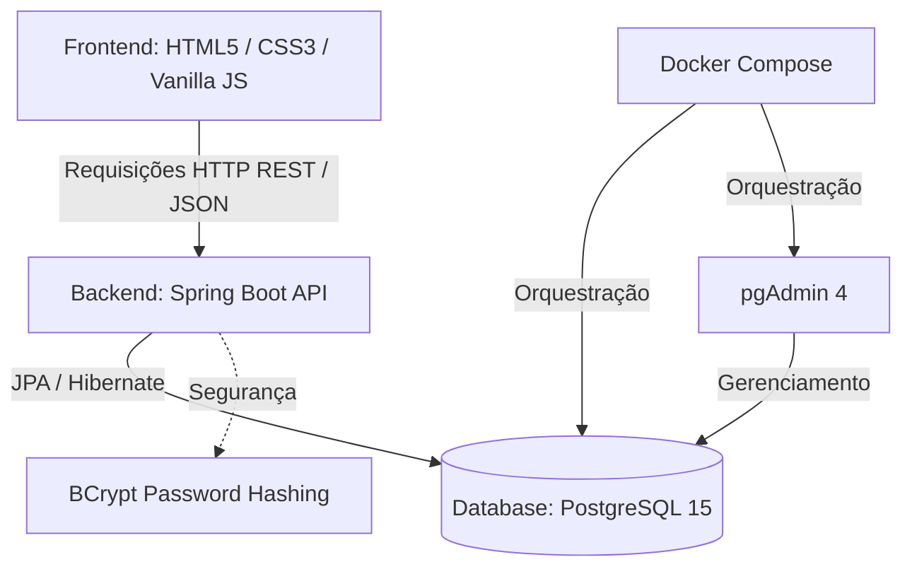

# 🔄 SENAI Exchange — Sistema de Troca de Itens entre Alunos

<p align="center">
  
</p>

<p align="center">
  <a href="#-sobre-o-projeto">Sobre</a> •
  <a href="#-funcionalidades">Funcionalidades</a> •
  <a href="#-arquitetura-do-sistema">Arquitetura</a> •
  <a href="#-estrutura-do-projeto">Estrutura</a> •
  <a href="#-tecnologias">Tecnologias</a> •
  <a href="#-como-executar">Como Executar</a> •
  <a href="#-api-endpoints">API Endpoints</a>
</p>

---

## 📝 Sobre o Projeto

O **SENAI Exchange** é uma plataforma de economia colaborativa desenvolvida especificamente para a comunidade de alunos do **SENAI**. O sistema visa facilitar o compartilhamento, doação e troca de materiais acadêmicos, ferramentas, componentes eletrônicos, livros e outros recursos didáticos de forma segura e sustentável entre os estudantes de diferentes cursos.

Com uma interface moderna e intuitiva, os alunos podem anunciar itens que não utilizam mais e solicitar a troca por recursos úteis para sua formação profissional.

---

## ✨ Funcionalidades

- 🔑 **Autenticação Segura:** Cadastro e login de alunos utilizando e-mail institucional do SENAI, com senhas criptografadas utilizando `BCrypt`.
- 📦 **Gestão de Anúncios (Catálogo):** Criação, edição, visualização e exclusão de anúncios de itens com detalhes como nome, descrição, categoria e imagens.
- 🔍 **Exploração e Filtros:** Busca inteligente por nome e filtros dinâmicos por categorias.
- 🤝 **Solicitação de Trocas:** Fluxo de negociação onde o aluno solicitante pode propor a troca de um item por outro.
- 💬 **Chat em Tempo Real:** Canal de comunicação integrado para cada proposta de troca, permitindo alinhar os detalhes e o ponto de encontro de forma segura.
- 👤 **Perfil do Usuário:** Página de edição de perfil mostrando informações do aluno, curso atual, foto de perfil e seus itens ativos.

---

## 🏗️ Arquitetura do Sistema

O projeto é construído em uma arquitetura **Client-Server** desacoplada, utilizando um backend robusto em **Spring Boot** que fornece uma API REST para o cliente **Single/Multi-page HTML5** construído com Javascript Puro (Vanilla JS) e CSS3 customizado.



---

## 📂 Estrutura do Projeto

Abaixo está a organização das pastas e arquivos principais do projeto:

```text
sistema-trocas-alunos/
├── backend/                       # Servidor Spring Boot (Java)
│   ├── src/main/java/br/com/senai/sistema_trocas/
│   │   ├── config/                # Configurações de CORS e Segurança
│   │   ├── controllers/           # Controladores REST da API
│   │   ├── entities/              # Entidades de mapeamento JPA (Banco de Dados)
│   │   ├── repositories/          # Interfaces de acesso ao banco (Spring Data JPA)
│   │   └── services/              # Regras de negócio da aplicação
│   ├── src/main/resources/
│   │   └── application.properties # Parâmetros do banco de dados e servidor
│   └── pom.xml                    # Gerenciador de dependências Maven
│
├── frontend/                      # Interface Web da Aplicação
│   ├── assets/                    # Logos e recursos visuais estáticos
│   ├── pages/                     # Páginas HTML da aplicação
│   │   ├── login.html             # Login do estudante
│   │   ├── cadastro.html          # Cadastro de novo aluno
│   │   ├── explorar.html          # Visualização geral de itens
│   │   ├── catalogo.html          # Gerenciamento de itens e anúncios
│   │   ├── novo-anuncio.html      # Formulário de criação de anúncio
│   │   ├── meus-pedidos.html      # Acompanhamento de propostas de troca
│   │   ├── chat.html              # Mensagens de negociação
│   │   └── perfil.html            # Visualização/Edição do perfil
│   ├── scripts/                   # Lógica JavaScript (comunicação com a API)
│   └── styles/                    # Estilização modular com CSS3
│
├── docker-compose.yml             # Orquestrador do Banco PostgreSQL & pgAdmin
├── package.json                   # Scripts adicionais e dependências node auxiliares
└── README.md                      # Documentação oficial do projeto
```

---

## 🛠️ Tecnologias Utilizadas

### **Backend**
- **Java 17** (Linguagem Principal)
- **Spring Boot 4.x**
  - **Spring Web** (Construção de APIs RESTful)
  - **Spring Data JPA** (Persistência e ORM)
  - **Spring Security Crypto** (Criptografia com BCrypt)
- **PostgreSQL Driver** (Conexão ao Banco)
- **Project Lombok** (Produtividade e redução de Boilerplate)

### **Frontend**
- **HTML5 Semantic Markup**
- **CSS3 Vanilla** (Variáveis nativas, Flexbox e CSS Grid para responsividade)
- **JavaScript ES6+** (Comunicação Assíncrona via `fetch`, manipulação de DOM e SessionStorage)

### **Infraestrutura / DevOps**
- **Docker & Docker Compose** (Containerização do PostgreSQL e pgAdmin 4)
- **PostgreSQL 15** (Banco de dados relacional)

---

## 🚀 Como Executar o Projeto

### **Pré-requisitos**
Antes de iniciar, certifique-se de ter instalado em sua máquina:
1. [Git](https://git-scm.com)
2. [Docker](https://www.docker.com/) & [Docker Compose](https://docs.docker.com/compose/)
3. [JDK 17](https://www.oracle.com/java/technologies/javase/jdk17-archive-downloads.html) ou superior
4. [Maven 3.x](https://maven.apache.org/) (Opcional, pois o projeto inclui o wrapper `./mvnw`)

---

### **Passo 1: Subir o Banco de Dados (Docker)**
Na raiz do projeto (onde está o `docker-compose.yml`), execute no terminal:
```bash
docker-compose up -d
```
> Isso iniciará um container PostgreSQL na porta `5432` e o pgAdmin na porta `8081`.
> - **pgAdmin:** Acesse [http://localhost:8081](http://localhost:8081) com o email `admin@gmail.com` e senha `admin12345`.

---

### **Passo 2: Iniciar o Backend (Spring Boot)**
Acesse a pasta do backend e execute o comando de inicialização do Maven wrapper:
```bash
cd backend
# No Windows:
mvnw.cmd spring-boot:run

# No Linux/macOS:
./mvnw spring-boot:run
```
> O servidor backend estará rodando no endereço: `http://localhost:8080`

---

### **Passo 3: Rodar o Frontend**
Como o frontend é composto por arquivos estáticos (`HTML`/`CSS`/`JS`), você pode executá-lo de duas formas:
1. **Direto no navegador:** Abrir o arquivo `frontend/pages/login.html` dando um duplo clique.
2. **Servidor Local (Recomendado):** Se possuir o Node.js, você pode instalar as dependências do projeto com `npm install` na raiz e rodar um servidor de desenvolvimento rápido, ou usar extensões como a *Live Server* do VSCode.

---

## 🔌 API Endpoints

A API do backend está estruturada sob os seguintes endpoints principais (`http://localhost:8080`):

### **Alunos (`/alunos`)**
| Método | Endpoint | Descrição |
|---|---|---|
| `POST` | `/alunos/cadastro` | Realiza o cadastro de um novo aluno |
| `GET` | `/alunos/login` | Realiza login do aluno (parâmetros `email` e `senha` via Query) |
| `GET` | `/alunos/{id}` | Busca os dados completos de um aluno pelo ID |
| `PUT` | `/alunos/{id}` | Atualiza as informações do aluno |

### **Itens (`/itens`)**
| Método | Endpoint | Descrição |
|---|---|---|
| `GET` | `/itens` | Retorna todos os itens cadastrados no sistema |
| `GET` | `/itens/{id}` | Busca um item específico por seu ID |
| `GET` | `/itens/aluno?value={id}` | Retorna todos os itens anunciados por um aluno |
| `GET` | `/itens/categoria?value={id}` | Retorna todos os itens pertencentes a uma categoria |
| `POST` | `/itens/cadastro` | Cadastra um novo anúncio de item |
| `DELETE` | `/itens/{id}` | Exclui um anúncio específico |

### **Trocas (`/trocas`)**
| Método | Endpoint | Descrição |
|---|---|---|
| `GET` | `/trocas` | Retorna o histórico de todas as trocas solicitadas |
| `POST` | `/trocas/cadastro` | Abre uma nova solicitação de troca de itens |
| `PUT` | `/trocas/{id}` | Modifica o status de uma troca (ex: aceitar ou recusar) |
| `DELETE` | `/trocas/{id}` | Cancela/exclui uma transação de troca |

### **Mensagens (`/mensagens`)**
| Método | Endpoint | Descrição |
|---|---|---|
| `GET` | `/mensagens` | Retorna todas as mensagens registradas |
| `GET` | `/mensagens/troca?value={id}` | Obtém a conversa/chat associado a uma troca específica |
| `POST` | `/mensagens/cadastro` | Envia uma nova mensagem no chat de uma troca |

---

## 🗄️ Modelo de Dados

O banco de dados é gerado automaticamente pelo Hibernate (`spring.jpa.hibernate.ddl-auto=update`) e contém as seguintes tabelas estruturadas:
- **`tb_aluno`**: Armazena os dados dos alunos (nome, email, senha criptografada, ID do curso).
- **`tb_curso`**: Cursos disponíveis no SENAI (ex: Desenvolvimento de Sistemas, Redes de Computadores).
- **`tb_categoria`**: Categorias dos itens (ex: Ferramentas, Livros, Componentes Eletrônicos).
- **`tb_item`**: Detalhes dos anúncios (nome, descrição, categoria, aluno proprietário).
- **`tb_imagem_item`**: Links ou referências visuais vinculadas aos itens.
- **`tb_troca`**: Registro das negociações contendo o `item_origem`, `item_destino`, `solicitante`, `receptor` e o `status` (PENDENTE, ACEITA, RECUSADA).
- **`tb_mensagem`**: Conteúdo textual enviado no chat vinculado a cada troca.

---

<p align="center">Desenvolvido com ❤️ para o Projeto Integrador do SENAI.</p>